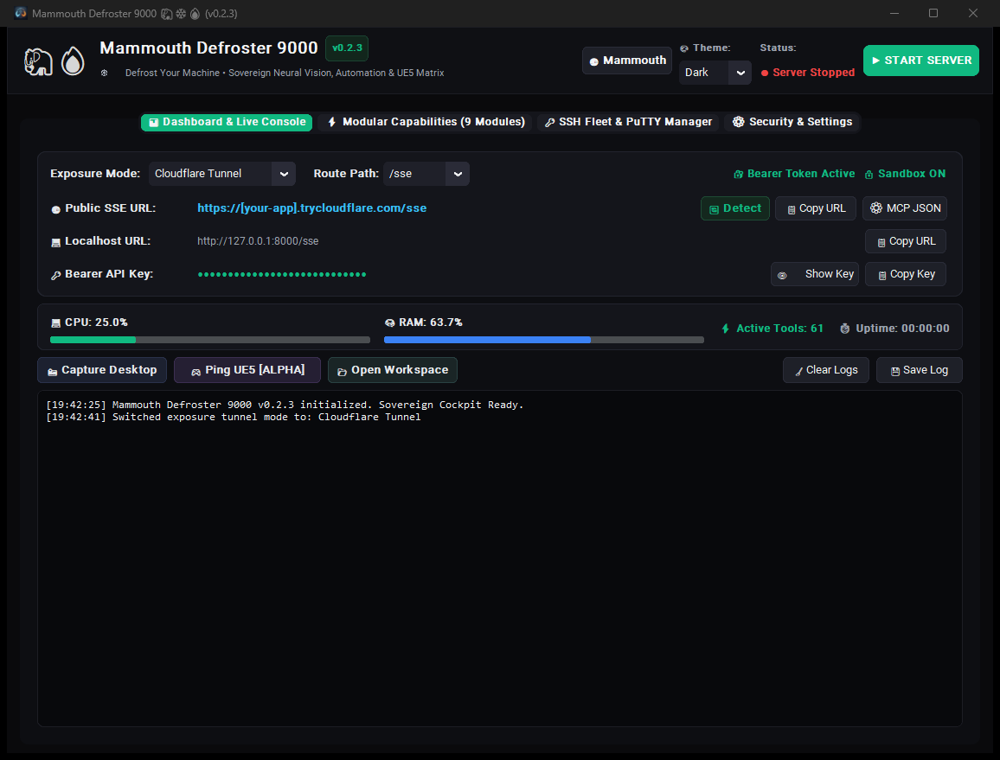

<p align="center">
  
</p>

<p align="center">
  <a href="https://github.com/hellforgex/Mammouth-Defroster-9000/releases"></a>
  
  
  
  
  
</p>

<h3 align="center">
  🦣 <b>Thawing 10,000 years of frozen Windows automation power for <a href="https://mammouth.ai">Mammouth.ai</a>.</b> 🔥
</h3>

<p align="center">
  <b>Mammouth Defroster 9000 (MD-9000)</b> is a sovereign FastMCP desktop cockpit and Windows automation platform engineered by <b>noskillz</b>. It connects your remote <a href="https://mammouth.ai">Mammouth.ai</a> assistant directly to your local Windows PC — letting your AI see your desktop, automate clicks & keystrokes, edit code in a safe workspace, run PowerShell commands, monitor hardware, and even control Unreal Engine 5.
</p>

<p align="center">
  
</p>

---

## 🚀 60-Second Quickstart (The Easy Way — No Python Needed!)

You do **not** need Python, Git, or terminal knowledge. Everything is bundled into a pre-compiled standalone package.

```
  1. Download ZIP  ──▶  2. Extract Anywhere  ──▶  3. Run start_gui.bat  ──▶  4. Connect to Mammouth.ai!
```

1. **Download the Release Package**:  
   👉 **[Download MammouthDefroster9000-v0.2.3-windows-x64.zip](https://github.com/hellforgex/Mammouth-Defroster-9000/releases/latest)** (~109 MB)
2. **Extract the ZIP**:  
   Extract the archive to any convenient folder on your Windows PC (e.g. `C:\MammouthDefroster9000` or your Desktop).
3. **Launch the Cockpit**:  
   Double-click **`start_gui.bat`** (or `MammouthDefroster9000.exe`).
4. **Click `▶ Start Server`**:  
   In the GUI dashboard, pick your preferred tunnel mode (e.g. **Tailscale Funnel** or **Cloudflare Quick Tunnel**) and click **`▶ Start Server`**!

---

## 🔗 Connecting with Mammouth.ai (Step-by-Step)

<p align="center">
  
</p>

Connecting MD-9000 to **Mammouth.ai** takes under a minute:

### Step 1: Copy Your Credentials from the Cockpit
In the **Mammouth Defroster 9000** dashboard:
* Click **`📋 Copy Endpoint`** next to your calculated Public Endpoint URL  
  *(e.g. `https://your-pc.ts.net/sse` or `https://xyz.trycloudflare.com/sse`)*
* Click **`📋 Copy Key`** to copy your secure Bearer API Token.

### Step 2: Add the Server in Mammouth.ai
1. Open **[Mammouth.ai](https://mammouth.ai)** in your browser.
2. Go to **Settings ⚙️** → **Custom MCP Servers**.
3. Click **Add MCP Server**:
   * **Name**: `Mammouth Defroster 9000`
   * **Type**: `SSE` *(Default & Recommended)* or `Streamable HTTP`
   * **URL**: Paste your copied Endpoint URL (`https://.../sse`)
   * **Bearer Token**: Paste your copied Bearer API Key *(or leave token in URL query parameter `?token=...`)*
4. Click **Save / Connect**.

### Step 3: Enjoy Full Automation!
Start a new chat with Mammouth! It will immediately discover your defrosted tools and can now assist you with system monitoring, file coding, visual inspection, and desktop tasks.

---

## 🌐 Choosing Your Exposure Mode

| Exposure Mode | Setup Difficulty | Best For | How it Works |
| :--- | :---: | :--- | :--- |
| **Tailscale Funnel** ⭐ *(Recommended)* | Easy | Anywhere in the world (Remote & Mobile) | Encrypted WireGuard tunnel via Tailscale. Gives you a permanent, secure `https://<node>.ts.net/sse` address. |
| **Cloudflare Quick Tunnel** | Zero Setup | Instant 1-click public testing | Bundled `cloudflared` generates a temporary `https://<id>.trycloudflare.com/sse` link. No account needed. |
| **Direct LAN IP** | Zero Setup | Same Wi-Fi / Local Home Network | Direct connection via your local network (`http://192.168.x.x:8000/sse`). Super fast, zero latency. |
| **ngrok HTTP** | Easy | Custom domains / ngrok users | Automatic tunnel creation with your personal ngrok authtoken. |

---

## 🛡️ Sovereign Privacy & Safety Built-In

MD-9000 gives AI assistants real Windows power, but keeps **you** in full control:

* 👁️ **Desktop Vision Consent Gate**: When Mammouth requests a desktop screenshot, an interactive prompt pops up asking for your permission before any image is captured. You can grant permission for one capture, the whole session, or revoke it anytime.
* 📁 **Sandboxed File Workspace**: By default, file read/write operations are strictly jailed inside `./workspace`, preventing unintended modifications to your Windows system files.
* 💻 **PowerShell Safety Default**: Direct command-line execution and background daemons are **disabled by default**. You must explicitly toggle the switch in the GUI if you want your AI to run PowerShell commands.
* 🔑 **Protected Token Auth**: All network endpoints enforce strong 32-character Bearer API token authentication.

---

## 🛠️ 10 Defrosted Modules (71 Tools Total)

<table align="center" width="100%">
  <thead>
    <tr>
      <th>Module</th>
      <th align="center">Status</th>
      <th align="center">Safety</th>
      <th>Capabilities</th>
      <th>Key Tools</th>
    </tr>
  </thead>
  <tbody>
    <tr>
      <td><b>👁️ Desktop Vision</b></td>
      <td align="center">Enabled</td>
      <td align="center">🔒 Consent Gate</td>
      <td>Multi-monitor screenshot capture with on-screen confirmation popup and LLM downscaling.</td>
      <td><code>screen_capture</code>, <code>screen_list_monitors</code>, <code>screen_grant_consent</code>, <code>screen_revoke_consent</code></td>
    </tr>
    <tr>
      <td><b>🖱️ Mouse & Keyboard</b></td>
      <td align="center">Enabled</td>
      <td align="center">🟡 Interactive</td>
      <td>Native Win32 desktop automation: cursor movement, clicks, drag-and-drop, scrolling, typing Unicode text, and hotkeys.</td>
      <td><code>mouse_move</code>, <code>mouse_click</code>, <code>mouse_drag</code>, <code>mouse_scroll</code>, <code>keyboard_type</code>, <code>keyboard_hotkey</code>, <code>desktop_get_screen_info</code></td>
    </tr>
    <tr>
      <td><b>🎮 Unreal Engine 5</b></td>
      <td align="center">Enabled</td>
      <td align="center">🟢 Safe</td>
      <td>Live UE5 Editor automation via Remote Control & Python API: inspect scenes, spawn actors, manipulate lights/materials, and capture viewports.</td>
      <td><code>unreal_ping</code>, <code>unreal_execute_python</code>, <code>unreal_spawn_actor</code>, <code>unreal_take_screenshot</code> <i>(23 tools total)</i></td>
    </tr>
    <tr>
      <td><b>🧠 Long-Term Memory</b></td>
      <td align="center">Enabled</td>
      <td align="center">🟢 Safe</td>
      <td>Persistent SQLite memory storage. Saves notes, context, and project info across separate chat sessions.</td>
      <td><code>memory_save</code>, <code>memory_recall</code>, <code>memory_list</code>, <code>memory_get</code>, <code>memory_delete</code></td>
    </tr>
    <tr>
      <td><b>📋 Tasks & Kanban</b></td>
      <td align="center">Enabled</td>
      <td align="center">🟢 Safe</td>
      <td>Persistent task manager and Kanban workflow (<code>todo</code>, <code>in_progress</code>, <code>done</code>, <code>blocked</code>).</td>
      <td><code>task_create</code>, <code>task_update</code>, <code>task_list</code>, <code>task_delete</code></td>
    </tr>
    <tr>
      <td><b>📁 File & Code Ops</b></td>
      <td align="center">Enabled</td>
      <td align="center">🔒 Sandboxed</td>
      <td>Safe workspace file reading, writing, precise line slicing, ripgrep text search, and directory tree exploration.</td>
      <td><code>file_read</code>, <code>file_write</code>, <code>file_replace_chunk</code>, <code>file_search_text</code>, <code>directory_tree</code></td>
    </tr>
    <tr>
      <td><b>💻 PowerShell & Daemons</b></td>
      <td align="center">Disabled by Default</td>
      <td align="center">⚠️ High Privilege</td>
      <td>Synchronous PowerShell execution and background process daemon manager.</td>
      <td><code>command_run</code>, <code>powershell_exec</code>, <code>process_start_background</code>, <code>process_get_output</code>, <code>process_kill_background</code></td>
    </tr>
    <tr>
      <td><b>🔑 PuTTY & SSH Remote</b></td>
      <td align="center">Enabled</td>
      <td align="center">🔒 DPAPI Encrypted</td>
      <td>Remote Linux/VPS management via plink, SCP file transfers, PuTTY GUI launch, and encrypted host storage.</td>
      <td><code>ssh_exec_command</code>, <code>ssh_open_putty_window</code>, <code>ssh_transfer_file</code>, <code>ssh_list_saved_hosts</code></td>
    </tr>
    <tr>
      <td><b>📊 System Diagnostics</b></td>
      <td align="center">Enabled</td>
      <td align="center">🟢 Safe</td>
      <td>Real-time hardware inspection: CPU, RAM, disk partitions, GPU info, top processes, and Windows Event Logs.</td>
      <td><code>system_get_specs</code>, <code>system_get_processes</code>, <code>system_get_gpu_info</code>, <code>system_get_event_logs</code></td>
    </tr>
    <tr>
      <td><b>🌐 Web Scraper & Tools</b></td>
      <td align="center">Enabled</td>
      <td align="center">🛡️ SSRF Shield</td>
      <td>Webpage content fetcher with clean markdown conversion and HTTP endpoint latency checks.</td>
      <td><code>web_fetch_url</code>, <code>web_check_status</code></td>
    </tr>
  </tbody>
</table>

---

## ❓ Beginner FAQ

<details>
<summary><b>1. Do I need Python installed on my computer?</b></summary>
<p><b>No!</b> If you download the pre-built release ZIP (<code>MammouthDefroster9000-v0.2.3-windows-x64.zip</code>), everything is self-contained. It includes all necessary runtimes, libraries, and executables. Just unzip and run!</p>
</details>

<details>
<summary><b>2. How do I turn on PowerShell commands?</b></summary>
<p>In the Cockpit GUI, click on the <b>Capabilities / Skills</b> tab. Find <b>PowerShell & Background Daemons</b> and toggle the switch to <b>ON</b>. Remember: only enable this if you trust your AI prompts!</p>
</details>

<details>
<summary><b>3. Is my screen or computer data sent to third parties?</b></summary>
<p><b>Never.</b> Mammouth Defroster 9000 runs 100% locally on your machine. There are no tracking scripts, telemetry, or third-party servers. All communications go directly between your PC and your own Mammouth.ai chat session through your chosen encrypted tunnel.</p>
</details>

<details>
<summary><b>4. Should I use <code>/sse</code> or <code>/mcp</code>?</b></summary>
<p>We recommend <b><code>/sse</code></b> (the standard Server-Sent Events route, which is selected by default). Both <code>/sse</code> and <code>/mcp</code> are fully supported by MD-9000 and handle Bearer token authentication cleanly.</p>
</details>

<details>
<summary><b>5. How do I stop or exit the server?</b></summary>
<p>Simply click the red <b><code>⏹ Stop Server</code></b> button in the GUI, or close the application window.</p>
</details>

---

## 💻 For Developers & Power Users

If you want to run from source, modify code, or use the dedicated CLI headless server:

### Running from Source
```bash
# Clone repository
git clone https://github.com/hellforgex/Mammouth-Defroster-9000.git
cd Mammouth-Defroster-9000

# Run with uv (or python)
uv run gui.py
```

### Dedicated Headless CLI Server
For automated startup or running without a GUI:
```bash
# Console server with live Uvicorn logs
.\MammouthDefroster9000-server.exe
# Or via batch script:
.\start_server.bat
```

### Building Your Own Standalone Package
```bash
# Compiles both GUI and CLI binaries into dist/ and packages release ZIP
.\build.bat
```

---

## 📂 Project Architecture

```
mammouth-defroster-9000/
├── assets/
│   ├── banner.png           # Widescreen hero banner
│   ├── icon.png             # High-res application icon
│   └── icon.ico             # Windows multi-resolution taskbar/window icon
├── modules/
│   ├── memory.py            # SQLite Long-term memory
│   ├── tasks_kanban.py      # SQLite Kanban & task tracker
│   ├── file_ops.py          # Sandboxed code & file operations
│   ├── shell_processes.py   # PowerShell execution & background daemons
│   ├── putty_ssh.py         # DPAPI-encrypted PuTTY / Plink / PSCP remote tools
│   ├── system_monitor.py    # Hardware & Windows diagnostics
│   ├── screen_capture.py    # Desktop vision & interactive consent gate
│   ├── desktop_input.py     # Win32 user32 mouse & keyboard automation
│   ├── unreal_engine.py     # Unreal Engine 5/4 Live Automation
│   └── web_tools.py         # SSRF-protected web scraper & status checks
├── config.py                # Configuration manager & token handling
├── config.example.json      # Hardened template configuration
├── hosts.example.json       # Template SSH hosts configuration
├── server.py                # FastMCP server with Auth & CORS middleware
├── gui.py                   # CustomTkinter Windows 11 Desktop Cockpit
├── start_gui.bat            # Quick GUI launcher script
├── start_server.bat         # Headless CLI server launcher
├── build.bat                # PyInstaller slim packager & ZIP generator
├── MammouthDefroster9000.spec # PyInstaller compilation specification
├── requirements.txt         # Pip dependency manifest
├── pyproject.toml           # Project metadata
├── LICENSE                  # MIT License & Legal Disclaimer
├── RELEASE_NOTES.md         # Canonical release documentation
├── CHANGELOG.md             # Version history
└── README.md                # Main documentation
```

---

> [!CAUTION]
> ### ⚠️ ⚡ NOSKILLZ VIBECODED DISCLAIMER & HARDCORE WARNING ⚡ ⚠️
>
> **WELCOME TO THE RAW AGENTIC POWERHOUSE.**
>
> This software is **100% pure vibe-coded** by **noskillz** for maximum execution speed, sovereign Windows 11 DevOps supremacy, and zero-compromise automation.
>
> 🦣 **With great agentic power comes absolute responsibility:**
> - You are handing an autonomous AI assistant real keys to your operating system: PowerShell execution, sandboxed file modifications, hardware diagnostics, and remote SSH servers.
> - **NEVER** expose this server publicly to the open internet without **Tailscale**, a private VPN, or Token Authentication enabled, unless you enjoy chaotic uninvited guests playing Doom in your PowerShell console.
> - By running this tool, you acknowledge that you are a sovereign captain of your machine. If you instruct an AI to *"clean up everything"* and it happily deletes your favorite meme stash, that is between you, the AI, and the cosmos.
> - Test your prompts, sandbox your workspaces, and embrace the agentic vibe responsibly. 🚀

---

## ⚖️ Legal Disclaimer & Limitation of Liability

> [!IMPORTANT]
> **Please read carefully before deploying or operating this software:**
>
> 1. **Gratuitous Provision ("As-Is" / Statutory Basis)**:  
>    This software is provided as an open-source project entirely free of charge on an **"as-is"** and **"as-available"** basis without warranties of any kind, either express or implied. Under governing statutory law for gratuitous software provision (including Section 521 of the German Civil Code / BGB), the legal liability of the author and developer (**noskillz / hellforgex**) is strictly limited to **intentional misconduct** (*Vorsatz*) and **gross negligence** (*grobe Fahrlässigkeit*). Any liability for ordinary, slight, or simple negligence is expressly excluded to the fullest extent permitted by applicable law.
>
> 2. **Sole Risk and Operator Responsibility**:  
>    The execution and utilization of all functions within this software—specifically modules executing local **PowerShell commands**, **file system modifications (writing, modifying, deleting)**, **system diagnostics**, **desktop input/vision automation**, and **remote SSH/VPS server operations (PuTTY / Plink / PSCP)**—is undertaken strictly at the user's sole risk. The operator assumes full and exclusive liability for all actions, scripts, and operations initiated by themselves or triggered by connected AI models and autonomous agents.
>
> 3. **Exclusion of Consequential Damages & Data Loss**:  
>    The author/developer shall not be held liable for any direct, indirect, incidental, special, consequential, or punitive damages, including but not limited to loss of data, corrupted databases, hardware damage, operating system crashes, downtime, security breaches, unauthorized third-party access, or financial losses resulting from the installation, execution, or network exposure of this software.
>
> 4. **Network and Tunnel Security**:  
>    The operator is solely responsible for properly configuring and securing all network interfaces, reverse proxies, and tunnel endpoints (e.g. via Tailscale VPN, private network isolation, firewalls, or token authentication). Exposing this server to the public internet without adequate authentication is performed entirely at the user's own peril.

---

## 📄 License
MIT License. Copyright (c) 2026 **noskillz** ([hellforgex](https://github.com/hellforgex)).  
Governed by the **Legal Disclaimer & Limitation of Liability** above.
