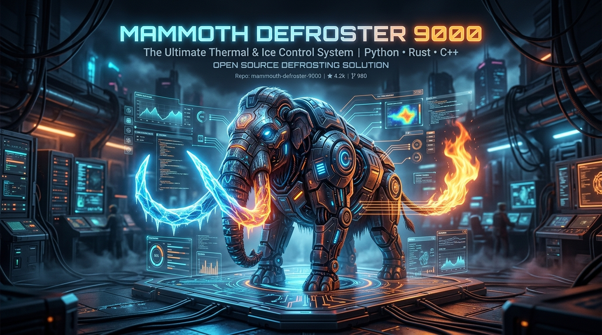

<p align="center">
  
</p>

<p align="center">
  <a href="https://github.com/hellforgex/Mammouth-Defroster-9000/releases"></a>
  
  
  
  
  
</p>

<h3 align="center">
  🦣 <b>Thawing 10,000 years of frozen Windows automation power for <a href="https://mammouth.ai">Mammouth.ai</a>.</b> 🔥
</h3>

<p align="center">
  <b>Mammouth Defroster 9000 (MD-9000)</b> is a sovereign FastMCP desktop cockpit and DevOps powerhouse engineered by <b>noskillz</b>. It bridges remote AI assistants directly to your local Windows environment, background daemons, and remote SSH server fleets with zero friction.
</p>

---

> [!CAUTION]
> ### ⚠️ ⚡ NOSKILLZ VIBECODED DISCLAIMER & HARDCORE WARNING ⚡ ⚠️
>
> **WELCOME TO THE RAW AGENTIC POWERHOUSE.**
>
> This software is **100% pure vibe-coded** by **noskillz** for maximum execution speed, sovereign Windows 11 DevOps supremacy, and zero-compromise automation.
>
> 🦣 **With great agentic power comes absolute responsibility:**
> - You are handing an autonomous AI assistant real keys to your operating system: PowerShell execution, sandboxed file modifications, hardware diagnostics, and remote SSH servers.
> - **NEVER** expose this server publicly to the open internet without **Tailscale**, a private VPN, or Token Authentication enabled, unless you enjoy chaotic uninvited guests playing Doom in your PowerShell console.
> - By running this tool, you acknowledge that you are a sovereign captain of your machine. If you instruct an AI to *"clean up everything"* and it happily deletes your favorite meme stash, that is between you, the AI, and the cosmos.
> - Test your prompts, sandbox your workspaces, and embrace the agentic vibe responsibly. 🚀

---

## ⚖️ Legal Disclaimer & Limitation of Liability

> [!IMPORTANT]
> **Please read carefully before deploying or operating this software:**
>
> 1. **Gratuitous Provision ("As-Is" / Statutory Basis)**:  
>    This software is provided as an open-source project entirely free of charge on an **"as-is"** and **"as-available"** basis without warranties of any kind, either express or implied. Under governing statutory law for gratuitous software provision (including Section 521 of the German Civil Code / BGB), the legal liability of the author and developer (**noskillz / hellforgex**) is strictly limited to **intentional misconduct** (*Vorsatz*) and **gross negligence** (*grobe Fahrlässigkeit*). Any liability for ordinary, slight, or simple negligence is expressly excluded to the fullest extent permitted by applicable law.
>
> 2. **Sole Risk and Operator Responsibility**:  
>    The execution and utilization of all functions within this software—specifically modules executing local **PowerShell commands**, **file system modifications (writing, modifying, deleting)**, **system diagnostics**, and **remote SSH/VPS server operations (PuTTY / Plink / PSCP)**—is undertaken strictly at the user's sole risk. The operator assumes full and exclusive liability for all actions, scripts, and operations initiated by themselves or triggered by connected AI models and autonomous agents.
>
> 3. **Exclusion of Consequential Damages & Data Loss**:  
>    The author/developer shall not be held liable for any direct, indirect, incidental, special, consequential, or punitive damages, including but not limited to loss of data, corrupted databases, hardware damage, operating system crashes, downtime, security breaches, unauthorized third-party access, or financial losses resulting from the installation, execution, or network exposure of this software.
>
> 4. **Network and Tunnel Security**:  
>    The operator is solely responsible for properly configuring and securing all network interfaces, reverse proxies, and tunnel endpoints (e.g. via Tailscale VPN, private network isolation, firewalls, or token authentication). Exposing this server to the public internet without adequate authentication is performed entirely at the user's own peril.

---

## 🌟 Key Features

<table align="center" width="100%">
  <tr>
    <td width="50%" valign="top">
      <h3>🖥️ Desktop Cockpit GUI</h3>
      <ul>
        <li><b>Modern Windows 11 Dark Mode</b> built with CustomTkinter.</li>
        <li><b>1-Click Server Lifecycle</b> with live process status badge.</li>
        <li><b>Real-Time Console Log Stream</b> monitoring every MCP handshake and tool call.</li>
        <li><b>Taskbar & System Tray Icons</b> featuring the official Defroster 9000 artwork.</li>
      </ul>
    </td>
    <td width="50%" valign="top">
      <h3>🌐 Multi-Tunnel Network Hub</h3>
      <ul>
        <li><b>Tailscale Funnel</b> zero-config auto-discovery (<code>https://&lt;node&gt;.ts.net/sse</code>).</li>
        <li><b>Cloudflare Quick Tunnels</b> (<code>trycloudflare.com</code>).</li>
        <li><b>ngrok HTTP Tunnels</b> with dynamic API polling.</li>
        <li><b>Direct LAN IP & Custom Proxies</b> (Nginx, Traefik, Caddy).</li>
      </ul>
    </td>
  </tr>
  <tr>
    <td width="50%" valign="top">
      <h3>🔒 Hardened Security Stack</h3>
      <ul>
        <li><b>Windows DPAPI Encryption</b> for saved SSH credentials in <code>hosts.json</code>.</li>
        <li><b>Workspace Sandboxing</b> preventing writes outside <code>./workspace</code>.</li>
        <li><b>SSRF Defense Filter</b> blocking private IP ranges & cloud metadata.</li>
        <li><b>PowerShell Input Sanitization</b> preventing command injection.</li>
      </ul>
    </td>
    <td width="50%" valign="top">
      <h3>⚡ Modular Skill Architecture</h3>
      <ul>
        <li><b>7 Granular Toolsets (32 Total Tools)</b>.</li>
        <li>Toggle individual modules on/off instantly via GUI switches.</li>
        <li>Dynamic FastMCP instruction generator informing connected models of active capabilities.</li>
      </ul>
    </td>
  </tr>
</table>

---

## 🛠️ 32 Defrosted MCP Tools

| Skill / Module | Icon | Security Profile | Core Capabilities | Tools |
| :--- | :---: | :---: | :--- | :--- |
| **Persistent Memory** | 🧠 | 🟢 Safe | SQLite cross-session knowledge storage with keyword search & categories | `memory_save`<br>`memory_recall`<br>`memory_list`<br>`memory_get`<br>`memory_delete` |
| **Tasks & Kanban** | 📋 | 🟢 Safe | Persistent task tracking (`todo`, `in_progress`, `done`, `blocked`) | `task_create`<br>`task_update`<br>`task_list`<br>`task_delete` |
| **File & Code Ops** | 📁 | 🔒 Sandboxed | Line slicing, ripgrep text search, chunk replacement, directory trees | `file_read`<br>`file_write`<br>`file_replace_chunk`<br>`file_search_text`<br>`directory_tree`<br>`directory_list` |
| **PowerShell & Daemons** | 💻 | ⚠️ High Privilege | Synchronous PowerShell execution & background daemon process manager | `command_run`<br>`process_start_background`<br>`process_get_output`<br>`process_list_background`<br>`process_kill_background` |
| **PuTTY & SSH Remote** | 🔑 | 🔒 DPAPI Encrypted | Remote command execution via plink, SCP file transfers, PuTTY GUI window launch | `ssh_exec_command`<br>`ssh_open_putty_window`<br>`ssh_transfer_file`<br>`ssh_list_saved_hosts`<br>`ssh_save_host`<br>`ssh_list_putty_registry_sessions` |
| **System Diagnostics** | 📊 | 🟢 Safe | CPU, RAM, Disk partitions, GPU specs, top processes, Windows Event Logs | `system_get_specs`<br>`system_get_processes`<br>`system_get_gpu_info`<br>`system_get_event_logs` |
| **Web Scraper & Tools** | 🌐 | 🛡️ SSRF Shield | Webpage text extractor with markdown conversion & HTTP endpoint latency check | `web_fetch_url`<br>`web_check_status` |

---

## 🚀 Quickstart

### Method 1: Launching via Python / `uv` (Recommended)

1. **Clone the repository**:
   ```bash
   git clone https://github.com/hellforgex/Mammouth-Defroster-9000.git
   cd Mammouth-Defroster-9000
   ```

2. **Launch the Defroster**:
   - Double-click **`start_gui.bat`**  
   *(or execute `uv run gui.py` / `python gui.py` in your terminal)*

---

### Method 2: Building Standalone Windows `.exe`

1. Double-click **`build_exe.bat`**.
2. The standalone compiled application with full icon integration will be generated in:  
   `dist\MammouthDefroster9000\MammouthDefroster9000.exe`

---

## 🔗 Connecting with Mammouth.ai

<p align="center">
  
</p>

1. In **Mammouth Defroster 9000**, select your **Exposure Mode** (e.g. *Tailscale Funnel*) and click **`▶ Start Server`**.
2. Click **`📋 Copy`** next to the calculated **Public Endpoint URL** (e.g. `https://<node>.ts.net/sse`).
3. Open **[Mammouth.ai](https://mammouth.ai)**:
   - Navigate to **Settings** → **Custom MCP Servers**.
   - Click **Add MCP Server**:
     - **Name**: `Mammouth Defroster 9000`
     - **Type**: `SSE` (Server-Sent Events)
     - **URL**: Paste your copied endpoint (`https://.../sse`).
   - Click **Save / Connect**.
4. Start a new chat! Mammouth will immediately discover and utilize your 32 defrosted tools.

---

## 📂 Project Architecture

```
mammouth-defroster-9000/
├── assets/
│   ├── banner.png           # Widescreen 8K cybernetic hero banner
│   ├── icon.png             # High-res application icon
│   └── icon.ico             # Windows multi-resolution taskbar/window icon
├── modules/
│   ├── __init__.py
│   ├── memory.py            # SQLite Long-term memory
│   ├── tasks_kanban.py      # SQLite Kanban & task tracker
│   ├── file_ops.py          # Sandboxed code & file operations
│   ├── shell_processes.py   # PowerShell execution & background daemons
│   ├── putty_ssh.py         # DPAPI-encrypted PuTTY / Plink / PSCP remote tools
│   ├── system_monitor.py    # Hardware & Windows diagnostics
│   └── web_tools.py         # SSRF-protected web scraper & status checks
├── config.py                # Security & Configuration manager
├── config.example.json      # Hardened template configuration
├── hosts.example.json       # Template SSH hosts configuration
├── server.py                # FastMCP server with Auth & CORS middleware
├── gui.py                   # CustomTkinter Windows 11 Desktop Cockpit
├── start_gui.bat            # Quick launcher script
├── build_exe.bat            # PyInstaller one-click builder
├── requirements.txt         # Pip dependency manifest
├── pyproject.toml           # Project metadata
├── LICENSE                  # MIT License & Legal Disclaimer
├── .gitignore               # Git security & cache filter
└── README.md                # Documentation & noskillz Manifesto
```

---

## 📄 License
MIT License. Copyright (c) 2026 **noskillz** ([hellforgex](https://github.com/hellforgex)).  
Governed by the **Legal Disclaimer & Limitation of Liability** above.
